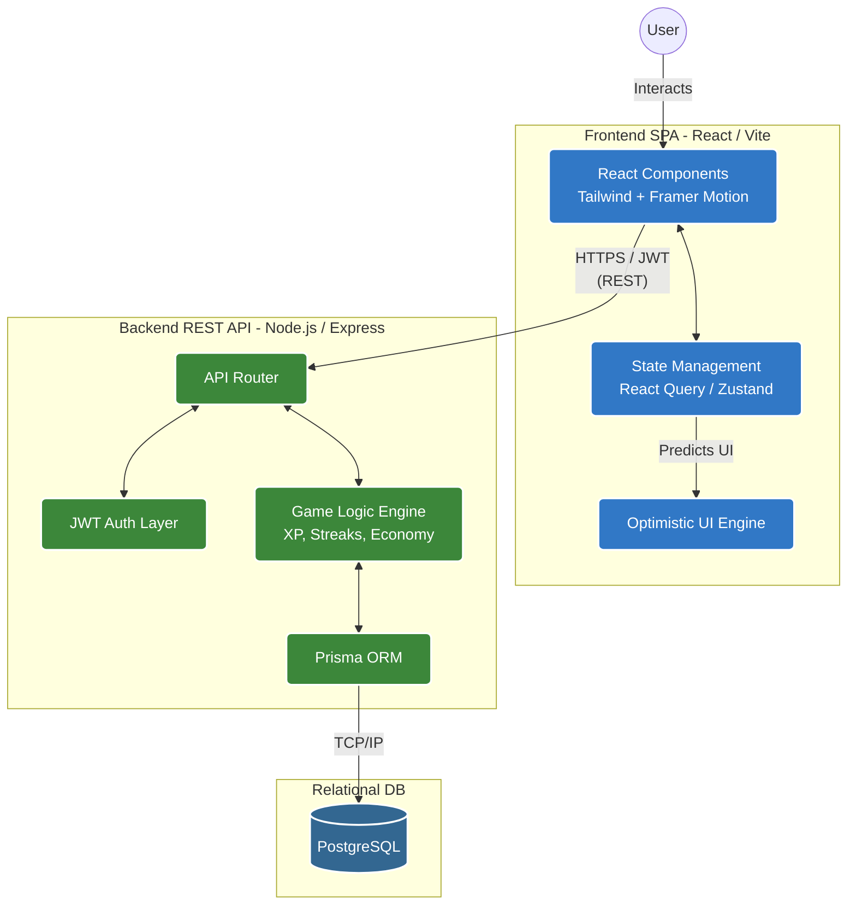
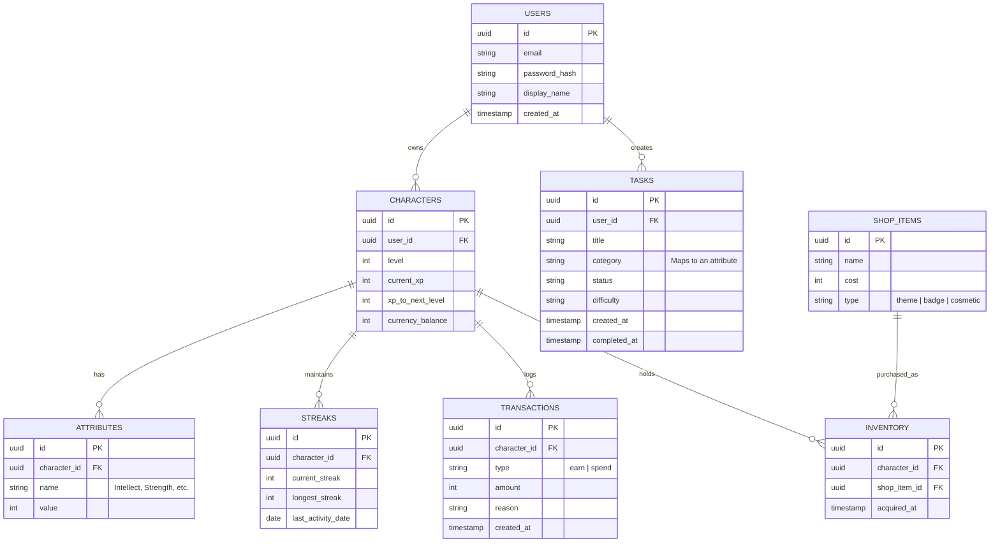
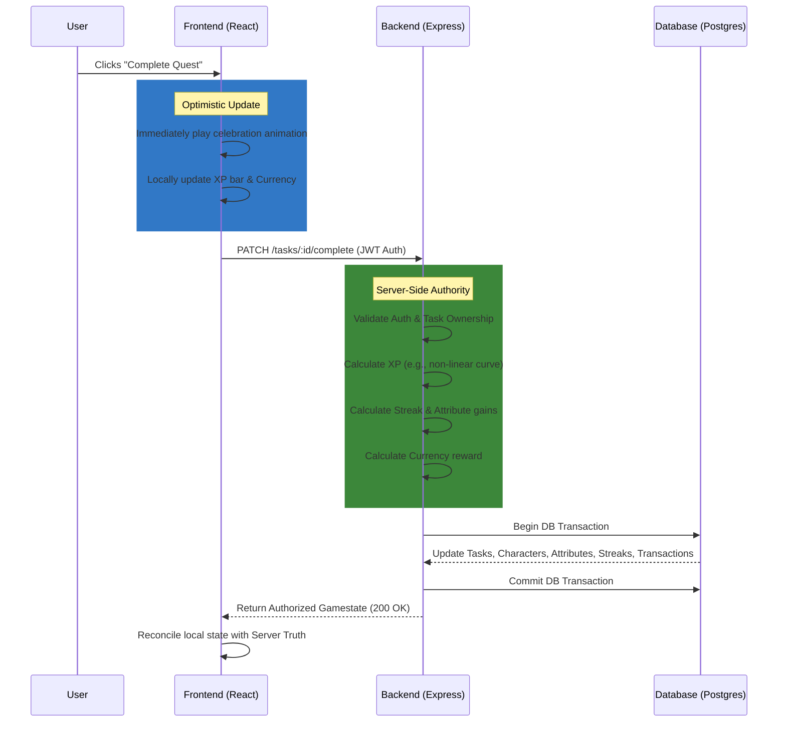

# 🐉 Life RPG: System Architecture & Specification

> **Vision:** Turn real-world habits into a persistent character-progression game. The app must feel like a game first—with instant feedback, juicy animations, and zero perceptible network lag—powered by a robust, secure full-stack architecture.

## 🏗️ 1. High-Level System Architecture

The system relies on a **Server-Authoritative Game Loop**. The frontend provides an optimistic UI for game feel, but the backend acts as the single source of truth to prevent cheating.

## 🗄️ 2. Database Entity-Relationship (ER) Schema

## 🔄 3. Core Game Loop: Quest Completion Flow

This sequence visualizes what happens when a user completes a task. Notice the optimistic update allowing immediate visual feedback.

## 🛠️ 4. Tech Stack & Implementation Details

| Category | Technology | Details / Rationale |
| :--- | :--- | :--- |
| **Frontend UI** | React + Vite | Fast HMR, component-based structure. |
| **Styling & Motion** | Tailwind CSS + Framer Motion | Rapid styling, necessary for "juicy" game-feel UI. |
| **State/Cache** | React Query / Zustand | Managing optimistic updates and server-state caching. |
| **Backend API** | Node.js + Express (or NestJS) | Lightweight REST architecture. |
| **Database** | PostgreSQL + Prisma ORM | Relational data integrity (crucial for users/tasks/transactions). |
| **Authentication** | JWT via `httpOnly` cookies | Secure session management (or Supabase/Clerk for speed). |
| **Deployment** | Vercel (Front) + Railway/Render (Back/DB) | Keeps backend and DB in one network dashboard. |

## 👥 5. Team Roles

| Role | Core Responsibilities |
| :--- | :--- |
| **Frontend Engineer** | App shell, React Query caching, game-feel animations, optimistic UI, accessibility. |
| **Backend Engineer** | REST API endpoints, Auth handling, server-side authority for game math, input validation. |
| **Database/API Engineer** | Schema design (Prisma), migrations, seed data, query optimization, API contract co-ownership. |
| **Deploy & UI/UX Lead** | Lock theme by Day 1, component design systems, CI/CD, environments, final smoke tests. |

> [!WARNING]
> **Zero-Tolerance Criteria for Launch:**
> - Data must survive a hard page refresh (no `localStorage` crutches).
> - Backend must connect to a production database.
> - Zero perceptible lag on task completion (Optimistic UI is mandatory).
> - Lighthouse score ≥90 for Performance and SEO.
